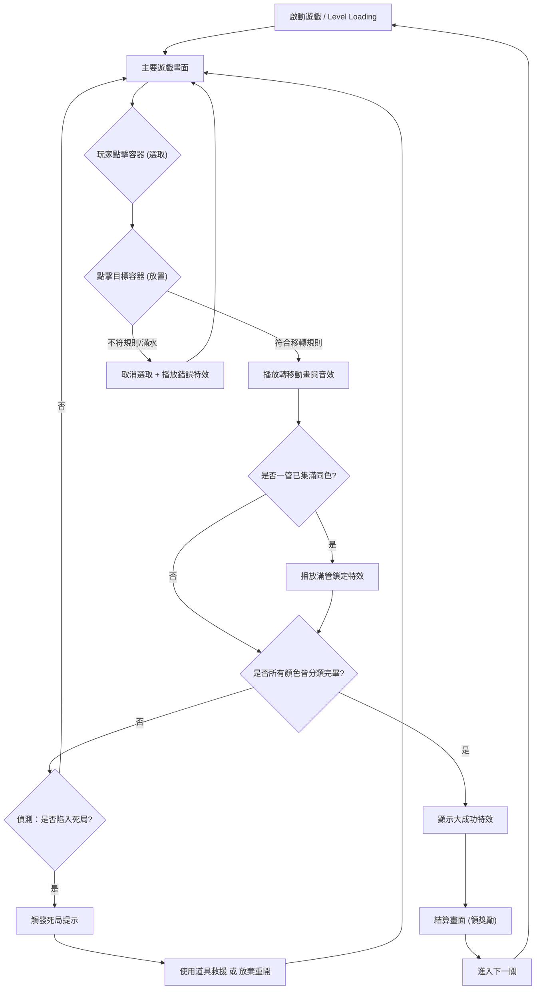

# 遊戲企劃規格書：Magic Sort (魔法分類解謎)

## 一、遊戲概覽 (Game Overview)
1. 核心定位：單指點擊即可輕鬆遊玩的休閒分類解謎遊戲 (Sort Puzzle)。
2. 核心體驗：透過邏輯推理將混亂的魔法元素（如各色魔藥、符文或寶石）進行分類歸位，利用極簡規律的消除回饋，創造「將無序化為有序」的極致解壓滿足感。

## 二、玩法概要													
1. 畫面上會提供數個容器（如試管、魔法陣或展示架），裡面隨機堆疊/混裝著不同顏色或種類的魔法元素。
2. 玩家點擊選擇某個容器中「最上層」的魔法元素，再次點擊任意目標容器將其轉移過去。
3. **轉移規則**：
   - 目標容器必須**還有剩餘空間**。
   - 目標容器最上層的元素必須與準備轉移的元素**顏色/種類相同**（若目標容器為「空容器」則無限制作為萬用承載）。
   - 若原容器上方有多個連續同色的元素，且目標空間足夠，點擊時會一次將同色群組轉移。
4. **輔助道具**：若玩家遭遇死局無法移動，可消耗金幣或觀看廣告使用道具（如：增加 1 個額外空容器、Undo 返回上一步、Shuffle 洗牌重新排列）。
5. **通關判定**：當畫面上所有的魔法元素，都分別以單一顏色各自獨立裝滿在各容器中（其餘容器全空）時，即判定通關。

## 三、遊戲流程													
1. **關卡進場**：系統根據關卡表格 (Level Design) 載入配置，將裝滿混合顏色的試管與部分空試管排列於畫面上，不設時間限制。
2. **選取操作**：玩家點擊包含元素的試管，該試管最上方所有「連續且同色」的元素會稍微浮起，並具有發光選取特效。
3. **無效操作**：若玩家點選不合規則的目標試管（顏色不對或容量已滿），被選取的元素會掉回原處，並播放錯誤音效與晃動提示 (Error Feedback)。
4. **有效轉移**：玩家點擊符合規則的空試管或同色試管，選取的元素會以拋物線或流體傾倒動畫，平滑轉移至目標內。
5. **即時反饋**：每次成功的轉移，都會播放清脆的液體/魔法顆粒音效；若連續快速成功轉移，音頻可做出逐步升階（Pitch Up）的聽覺刺激。
6. **單管完成**：當某一種顏色的元素完全湊滿一個試管時，該試管會播放專屬亮晶晶特效或蓋上木塞封口，該試管判定鎖定不可再取出。
7. **過關結算**：全部分類完成時，畫面所有試管同時綻放成功特效，隨後進到過關頁面，發放金幣與經驗值。
8. **死局判定**：當系統即時運算發現「畫面上沒有任何合法步驟可移動」時，自動彈出死局提示框，建議玩家使用道具自救或按 Restart 重新開始本關。

## 四、流程圖

